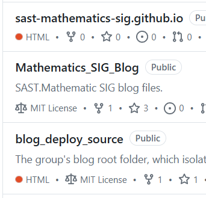
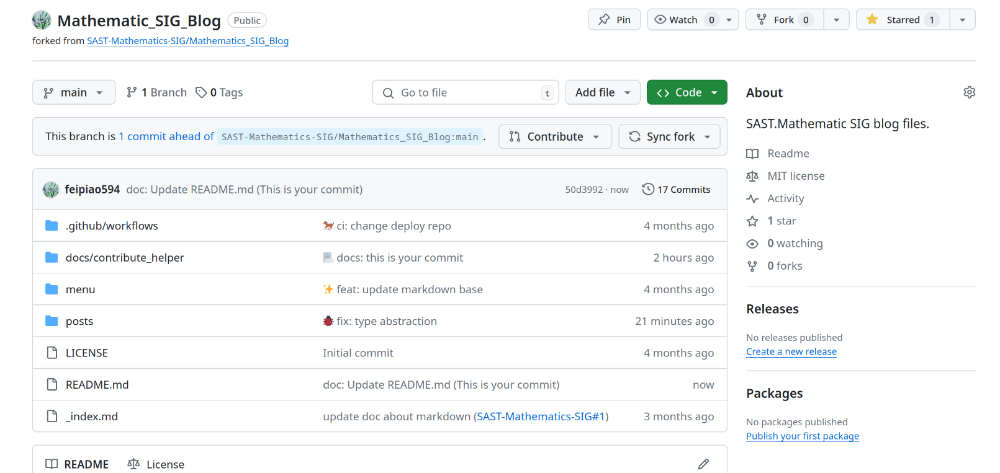
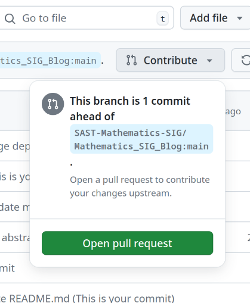
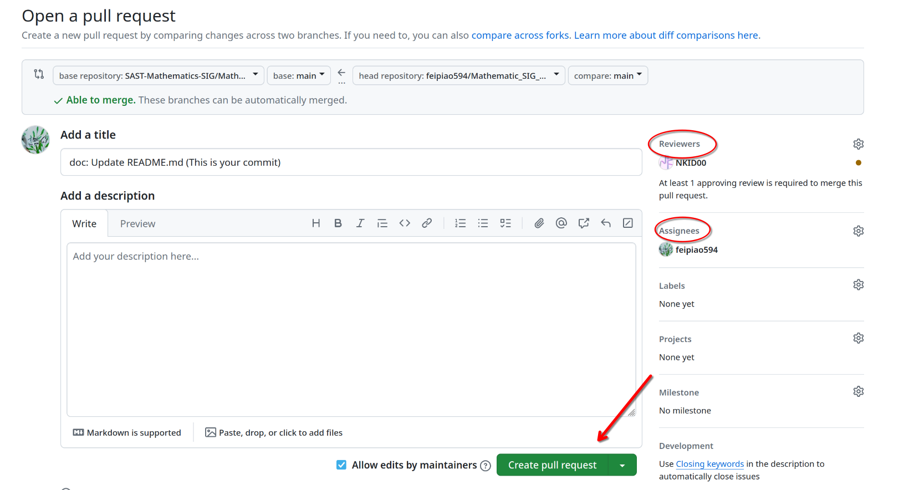

# 使用pull request提交文档

本站部署基于 **SAST-Mathematics-SIG** 下的三个Github仓库

- `Mathematics_SIG_Blog`: `*.md` 文档全都置于这个仓库中
- `blog_deploy_source`: 一些 Blog 配置相关的仓库
- `sast-mathematics-sig.github.io`: github page部署使用的仓库

采用这样的方案主要是为了让配置文件和文档本身分离，当你需要提交你的文档时，你需要

1. fork `Mathematics_SIG_Blog`仓库
2. 在本地对这个仓库的内容进行修改
3. 向上游仓库提起 pull request ，等待我们的回应
4. pull request 合入仓库，你的文档就能正常的在网页上显示了

## pull request 教程

当你对本地 fork 的仓库进行了一些修改之后，你的仓库是长这样的

点击 Contribute ，并点击 Open pull request

接着你就可以进入提交 pr 的界面了，注意，请你指定一个 Reviewer 来检查你的提交，Assignees 请你指定你自己

创建完成后，你可以在仓库的 pull request 处看见自己提交的 pr，你需要等待 Reviewer 检查后方可合入
